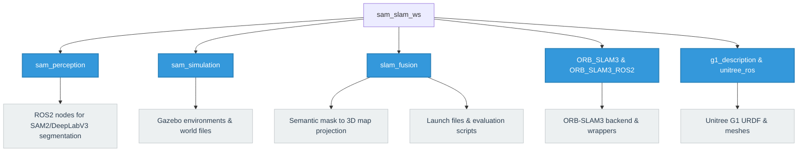

# Subgroup I1: SAM‑Enhanced 3D Semantic SLAM

## About the Project & Problem Solved
Traditional SLAM (Simultaneous Localization and Mapping) systems excel at creating geometric maps of an environment but lack semantic understanding. This restricts robots from performing high-level tasks such as finding specific objects or understanding scene context.

This project solves this problem by integrating foundation model segmentation (SAM2) and classical semantic segmentation (DeepLabV3) into real-time 3D SLAM pipelines. By fusing 2D segmentation masks with 3D SLAM point clouds, the system produces **semantically labeled 3D maps**. This allows us to benchmark and evaluate which SLAM architecture best supports foundation-model-based semantic integration in terms of geometric accuracy, semantic consistency, and real-time performance.

## Algorithms Used & Comparison

### 1. Perception Algorithms
| Feature | SAM2 (Segment Anything Model 2) | DeepLabV3 |
|---------|--------------------------------|-----------|
| **Architecture** | Vision Transformer (Foundation Model) | Classical Convolutional Neural Network (ASPP) |
| **Generalization** | **Zero-shot:** Segments unknown objects without retraining. | **Supervised:** Limited to specific trained classes. |
| **Performance** | Computationally heavy (lower FPS, higher latency). | Faster inference, suitable for strict real-time constraints. |

### 2. SLAM Backends
| SLAM Algorithm | Primary Sensor | Mechanism | Strengths | Weaknesses |
|----------------|----------------|-----------|-----------|------------|
| **ORB-SLAM3** | RGB Camera | Visual feature tracking (FAST/ORB) + Bundle Adjustment | Highly accurate in texture-rich areas; great loop closure (DBoW2). | Drifts or fails in featureless environments (e.g., blank walls). |
| **RTAB-Map** | RGB-D Camera | Visual Odometry + Graph Optimization with Memory Management | Natively generates dense point clouds; highly robust indoors. | Sensitive to depth sensor noise (e.g., IR interference). |
| **Cartographer**| 3D LiDAR | Scan-to-submap matching (Ceres) + Pose Graph Optimization | Extremely robust structural mapping; independent of lighting. | Requires complex synchronization to fuse with RGB semantic masks. |

**Evaluation Metrics:** 
The algorithms are evaluated using `evo` for **Absolute Trajectory Error (ATE)** (global geometric consistency) and **Relative Pose Error (RPE)** (local drift and semantic mask alignment), alongside real-time metrics (latency, FPS).
## Project Structure


## Role of the Jupyter Notebook

The Jupyter Notebook acts as the central control and evaluation dashboard for this project. Instead of running the ROS2 nodes and SLAM backends manually from the terminal, the notebook allows you to:
- Interactively launch different SLAM configurations (e.g., ORB-SLAM3, Cartographer, RTAB-Map).
- Process the resulting trajectory data.
- Dynamically compute error metrics (ATE, RPE).
- Visualize the output maps and semantic data directly within the notebook environment.

## Running the Jupyter Notebooks

This project can be run either locally or via a Docker container.

### Option 1: Running via Docker (Recommended)

Using Docker ensures that all dependencies (ROS2, SAM2, DeepLabV3, Jupyter) are pre-configured.

1. Ensure you have Docker and Docker Compose installed on your system.
2. Navigate to the workspace directory containing the `Dockerfile` or `docker-compose.yml`.
3. Build and start the container:
   ```bash
   docker-compose up --build
   ```
   *(If you are just using a Dockerfile, you can build with `docker build -t sam_slam .` and run with port forwarding `docker run -p 8888:8888 sam_slam`)*
4. Once the container is running, it will start the Jupyter Notebook server.
5. Check your terminal output for the Jupyter URL (e.g., `http://localhost:8888/?token=...`) and open it in your browser.
6. Navigate to the `notebooks` directory within the Jupyter interface.
7. Open `ipywidgets.ipynb` and run the cells to interact with the project.

### Option 2: Running on a Local Machine

If you prefer to run the project natively without Docker, follow these steps:

1. Make sure you have ROS2, Python, and the necessary dependencies (SAM2, DeepLabV3, `evo`) installed.
2. Install Jupyter and the required Python packages:
   ```bash
   pip install jupyter ipywidgets matplotlib numpy pandas
   ```
3. Navigate to the project workspace:
   ```bash
   cd src/notebooks
   ```
4. Start the Jupyter Notebook server:
   ```bash
   jupyter notebook
   ```
5. A browser window will open automatically. Open `ipywidgets.ipynb`.
6. Run the cells sequentially to start the SLAM pipelines, load the trajectory outputs (e.g., from `KeyFrameTrajectory.txt`), and generate the evaluation plots.
