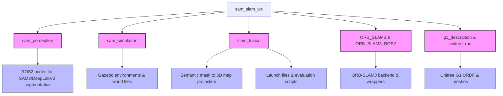

# Subgroup I1: SAM‑Enhanced 3D Semantic SLAM

## About the Project & Problem Solved
Traditional SLAM (Simultaneous Localization and Mapping) systems excel at creating geometric maps of an environment but lack semantic understanding. This restricts robots from performing high-level tasks such as finding specific objects or understanding scene context.

This project solves this problem by integrating foundation model segmentation (SAM2) and classical semantic segmentation (DeepLabV3) into real-time 3D SLAM pipelines. By fusing 2D segmentation masks with 3D SLAM point clouds, the system produces **semantically labeled 3D maps**. This allows us to benchmark and evaluate which SLAM architecture best supports foundation-model-based semantic integration in terms of geometric accuracy, semantic consistency, and real-time performance.

## Algorithms Used & Comparison

**Perception / Segmentation Algorithms:**
- **SAM2 (Segment Anything Model 2):** A foundation model evaluated for its zero-shot segmentation capabilities without fine-tuning.
- **DeepLabV3:** A classical baseline semantic segmentation model trained on specific classes for comparison.

**SLAM Backends (Fused with Segmentation):**
- **ORB-SLAM3:** Visual feature-based SLAM.
- **RTAB-Map:** RGB-D Graph-based SLAM.
- **Cartographer:** LiDAR/Depth-based SLAM.

**Comparison Metrics:** 
The algorithms are compared based on geometric accuracy (ATE, RPE), semantic label consistency across frames, and real-time performance metrics (latency, FPS).

## Project Structure


## How to Run Gazebo Simulation for Each Algorithm
You can run each SLAM algorithm in the Gazebo simulation environment by specifying the `run_mode` and `perception_model`. 

To run **ORB-SLAM3**:
```bash
ros2 launch slam_fusion eval_orbslam3.launch.py run_mode:=simulation perception_model:=sam2
```

To run **Cartographer**:
```bash
ros2 launch slam_fusion eval_cartographer.launch.py run_mode:=simulation perception_model:=sam2
```

To run **RTAB-Map**:
```bash
ros2 launch slam_fusion eval_rtabmap.launch.py run_mode:=simulation perception_model:=sam2
```
*(Note: You can change `perception_model:=sam2` to `perception_model:=deeplabv3` to test the classical baseline).*

## Running the Error Calculation
Once a simulation is finished, trajectories are saved to evaluate the geometric accuracy. You can use the provided bash script to calculate the Absolute Trajectory Error (ATE) and Relative Pose Error (RPE) using `evo`.

```bash
cd src/slam_fusion/scripts
./evaluate_trajectory.sh <estimated_trajectory_file> <groundtruth_file>
```
**Example:**
```bash
./evaluate_trajectory.sh /ros2_ws/orbslam3_sam2_estimate.txt /ros2_ws/gazebo_groundtruth.txt
```
