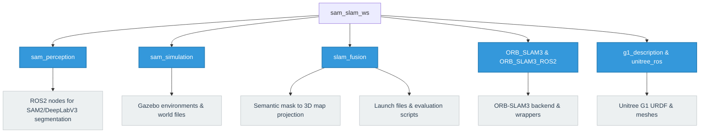

# Subgroup I1: SAM‑Enhanced 3D Semantic SLAM

## About the Project & Problem Solved
Traditional SLAM (Simultaneous Localization and Mapping) systems excel at creating geometric maps of an environment but lack semantic understanding. This restricts robots from performing high-level tasks such as finding specific objects or understanding scene context.

This project solves this problem by integrating foundation model segmentation (SAM2) and classical semantic segmentation (DeepLabV3) into real-time 3D SLAM pipelines. By fusing 2D segmentation masks with 3D SLAM point clouds, the system produces **semantically labeled 3D maps**. This allows us to benchmark and evaluate which SLAM architecture best supports foundation-model-based semantic integration in terms of geometric accuracy, semantic consistency, and real-time performance.

## Algorithms Used & Comparison

### 1. Perception Algorithms
| Feature | SAM2 (Segment Anything Model 2) | DeepLabV3 |
|---------|--------------------------------|-----------|
| **Architecture** | Vision Transformer (Foundation Model) | Classical Convolutional Neural Network (ASPP) |
| **Generalization** | **Zero-shot:** Segments unknown objects without retraining. | **Supervised:** Limited to specific trained classes. |
| **Performance** | Computationally heavy (lower FPS, higher latency). | Faster inference, suitable for strict real-time constraints. |

### 2. SLAM Backends
| SLAM Algorithm | Primary Sensor | Mechanism | Strengths | Weaknesses |
|----------------|----------------|-----------|-----------|------------|
| **ORB-SLAM3** | RGB Camera | Visual feature tracking (FAST/ORB) + Bundle Adjustment | Highly accurate in texture-rich areas; great loop closure (DBoW2). | Drifts or fails in featureless environments (e.g., blank walls). |
| **RTAB-Map** | RGB-D Camera | Visual Odometry + Graph Optimization with Memory Management | Natively generates dense point clouds; highly robust indoors. | Sensitive to depth sensor noise (e.g., IR interference). |
| **Cartographer**| 3D LiDAR | Scan-to-submap matching (Ceres) + Pose Graph Optimization | Extremely robust structural mapping; independent of lighting. | Requires complex synchronization to fuse with RGB semantic masks. |

**Evaluation Metrics:** 
The algorithms are evaluated using `evo` for **Absolute Trajectory Error (ATE)** (global geometric consistency) and **Relative Pose Error (RPE)** (local drift and semantic mask alignment), alongside real-time metrics (latency, FPS).
## Project Structure


## How to Run Gazebo Simulation for Each Algorithm
You can run each SLAM algorithm in the Gazebo simulation environment by specifying the `run_mode` and `perception_model`. 

To run **ORB-SLAM3**:
```bash
ros2 launch slam_fusion eval_orbslam3.launch.py run_mode:=simulation perception_model:=sam2
```

To run **Cartographer**:
```bash
ros2 launch slam_fusion eval_cartographer.launch.py run_mode:=simulation perception_model:=sam2
```

To run **RTAB-Map**:
```bash
ros2 launch slam_fusion eval_rtabmap.launch.py run_mode:=simulation perception_model:=sam2
```
*(Note: You can change `perception_model:=sam2` to `perception_model:=deeplabv3` to test the classical baseline).*

## Running the Error Calculation
Once a simulation is finished, trajectories are saved to evaluate the geometric accuracy. You can use the provided bash script to calculate the Absolute Trajectory Error (ATE) and Relative Pose Error (RPE) using `evo`.

```bash
cd src/slam_fusion/scripts
./evaluate_trajectory.sh <estimated_trajectory_file> <groundtruth_file>
```
**Example:**
```bash
./evaluate_trajectory.sh /ros2_ws/orbslam3_sam2_estimate.txt /ros2_ws/gazebo_groundtruth.txt
```

## Running the Jupyter Notebooks

This repository includes Jupyter Notebooks for interactive data analysis and visualization of the SLAM algorithms' performance. The notebooks process the trajectory data and compute error metrics dynamically.

### How to use the notebooks

1. Make sure you have Jupyter installed (or use VS Code with the Jupyter extension).
2. Navigate to the `notebooks` directory.
3. Open `ipywidgets.ipynb` to access the interactive data visualization.
4. Run the cells sequentially to load the trajectory outputs (e.g., from `KeyFrameTrajectory.txt`) and generate the evaluation plots.
